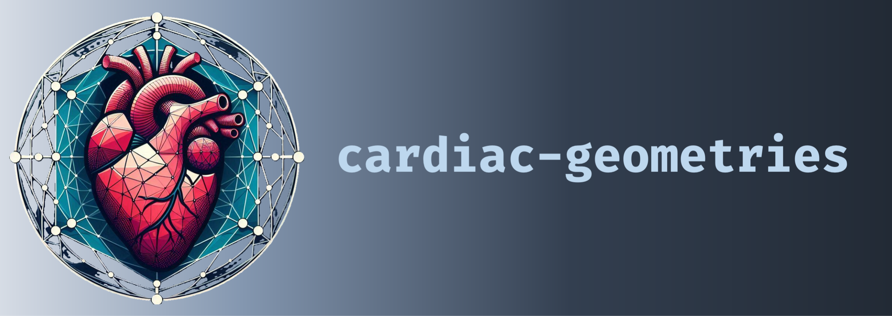

[](https://github.com/ComputationalPhysiology/cardiac-geometriesx/actions/workflows/docker-image.yml)
[](https://github.com/ComputationalPhysiology/cardiac-geometriesx/actions/workflows/test.yml)
[](https://github.com/ComputationalPhysiology/cardiac-geometriesx/actions/workflows/test-mpi.yml)
[](https://github.com/ComputationalPhysiology/cardiac-geometriesx/actions/workflows/pre-commit.yml)
[](https://badge.fury.io/py/cardiac-geometriesx)

# Cardiac geometries

Cardiac geometries is a software package built on top of [`cariac-geometries-core`](https://github.com/ComputationalPhysiology/cardiac-geometries-core) that adds support for creating idealized cardiac geometries for dolfinx.

There are two ways you can use `cardiac-geomtries`, either using the command line interface, e.g
```
geox lv-ellipsoid --create-fibers lv-mesh --fiber-space P_2
```

or using the python API e.g
```python
geo =  cardiac_geometries.mesh.lv_ellipsoid(outdir="lv-mesh", create_fibers=True, fiber_space="P_2")
```

## Install

To install the package you can use `pip`
```
python3 -m pip install cardiac-geometriesx
```
however, this assumes that you already have `dolfinx` pre-installed. You can also use the provided docker image e.g
```
docker pull ghcr.io/computationalphysiology/cardiac-geometriesx:latest
```
To start a new container interactive you can do
```
docker run --name geox -v $PWD:/home/shared -w /home/shared -it ghcr.io/computationalphysiology/cardiac-geometriesx:latest
```
or if you just want to create a mesh and exit you can run the command line interface directly e.g
```
docker run --rm -v $PWD:/home/shared -w /home/shared -it ghcr.io/computationalphysiology/cardiac-geometriesx:latest geox lv-ellipsoid --create-fibers lv-mesh --fiber-space P_2
```

## Authors
Henrik Finsberg (henriknf@simula.no)

## License
MIT

## Contributing
